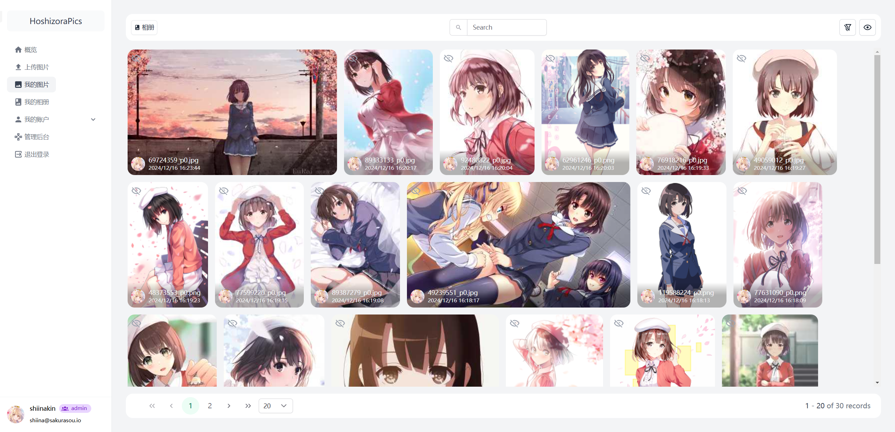
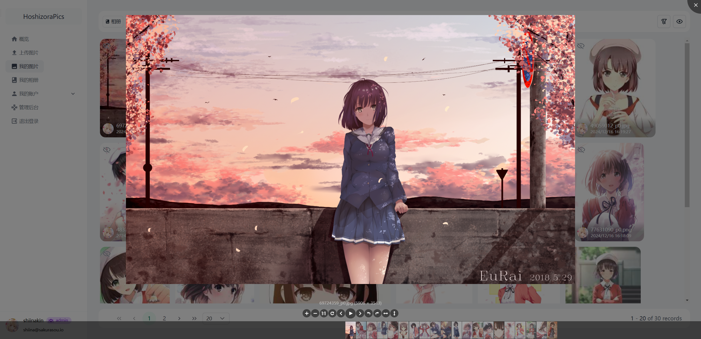
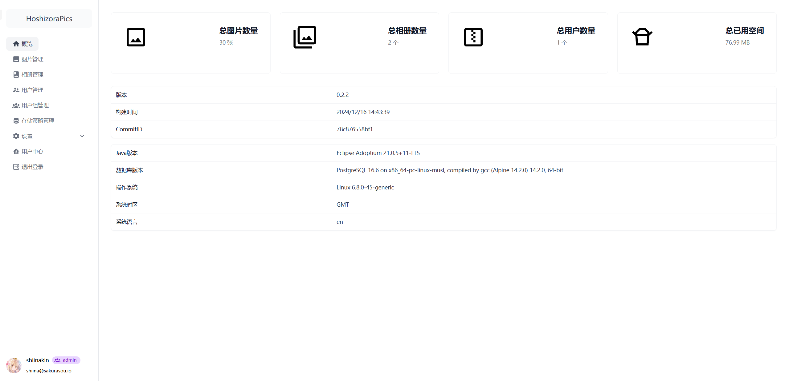

    
    <h2>HoshizoraPics</h2>

---

中文 | [English](README_EN.md)

## 介绍

HoshizoraPics 是一个简洁而功能完备的个人图片管理平台，使用 Kotlin + Vue 开发，致力于提供便捷的图片管理和分享功能。

## 特性

- 📸 图片管理
    - 支持图片上传、删除、编辑和查看
    - 支持批量操作
    - 图片预览和详细信息展示
    - 图片权限控制
    - 支持获取随机图片
- 📁 相册管理
    - 创建和管理相册
    - 灵活的相册分类
- 🔐 用户管理
    - 用户认证与授权
    - 自定义用户组
    - 灵活的角色权限配置
- 💾 多种存储方案
    - 本地存储
    - S3 兼容存储

## 图片预览

## 快速开始

1. `git clone https://github.com/ShiinaKin/hoshizora-pics.git`
2. `cd hoshizora-pics`
3. `docker compose up -d`

## 部署说明

1. 请在反代后使用
2. 请修改`compose.yml`中的环境变量，尤其是关于JWT的配置

## 升级说明

1. 请备份数据库
2. 修改`compose.yml`中的镜像版本
3. `docker compose up -d`

## 开源协议

HoshizoraPics 使用 GNU General Public License v3.0 开源协议，详情请查看 [LICENSE](LICENSE) 文件。
