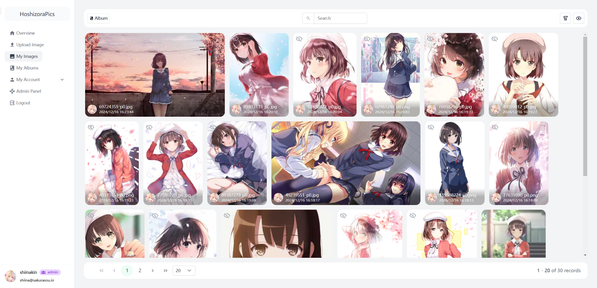
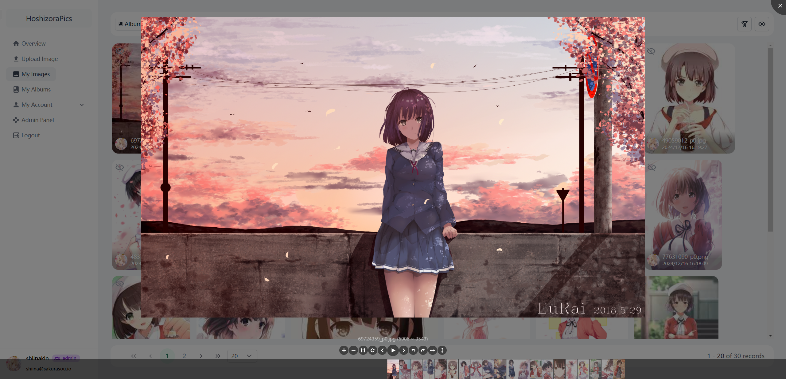
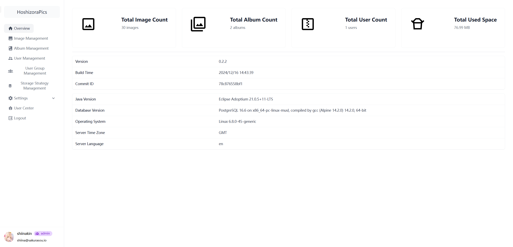

    
    <h2>HoshizoraPics</h2>

---

[中文](README.md) | English

## Introduction

HoshizoraPics is a concise yet fully-featured personal image management platform developed with Kotlin + Vue, dedicated
to providing convenient image management and sharing functionality.

## Features

- 📸 Image Management
    - Support image upload, deletion, editing, and viewing
    - Support batch operations
    - Image preview and detailed information display
    - Image permission control
    - Support for fetching random images
- 📁 Album Management
    - Create and manage albums
    - Flexible album categorization
    - Album permission control
- 🔐 User Management
    - User authentication and authorization
    - Custom user groups
    - Flexible role permission configuration
- 💾 Multiple Storage Solutions
    - Local storage
    - S3-compatible storage
    - WebDav

## Preview

## Quick Start

1. `git clone https://github.com/ShiinaKin/hoshizora-pics.git`
2. `cd hoshizora-pics`
3. `docker compose up -d`

## Deployment Notes

1. Please use behind a reverse proxy server, such as Nginx
2. Please modify the environment variables in `compose.yml`, especially the JWT configuration

## Upgrade Instructions

1. Please backup your database
2. Modify the image version in `compose.yml`
3. `docker compose up -d`

## License

HoshizoraPics is licensed under the GNU General Public License v3.0, please see the [LICENSE](LICENSE) file for details.
